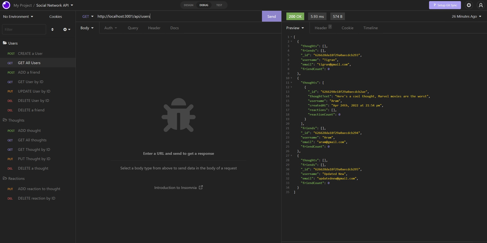

# Social Network website backend

## Demonstration Screenshots

## Purpose
Database for social network website, with users, thoughts, reactions and friends.

## Built With
* 
* 
* 
* 

## Demonstration Video link
https://clipchamp.com/watch/G26a5GWiEu2

## GitHub Repository Link
https://github.com/TigranBalayan10/friend-zone-api

## Contribution
Made by Tigran Balayan